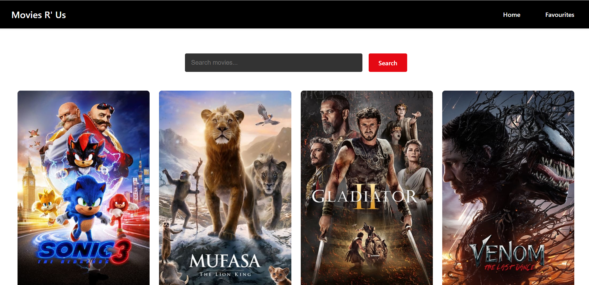
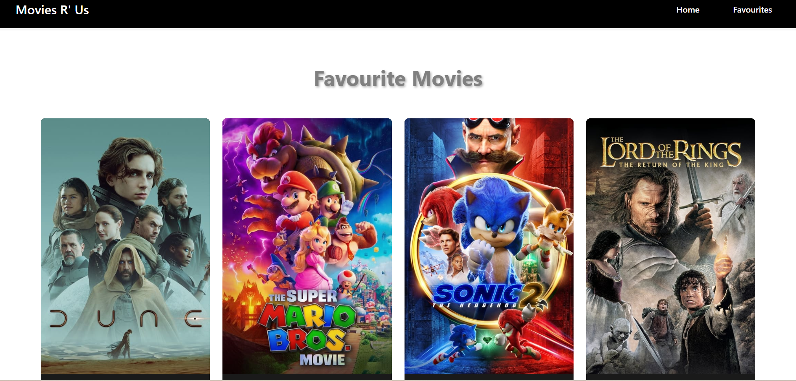

# **Movies R' US 🎥**

A modern React app built with **Vite** and **Tailwind CSS**, where you can discover trending movies, search the movie database, and manage your favorite picks.

---

## **Features**

- 🌟 **Trending Movies**: Explore the latest trending movies updated daily.
- 🔍 **Search**: Quickly find movies in the extensive database.
- ❤️ **Favorites Management**: Save your favorite movies to your personalized list.
- 🚀 **Lightning-Fast**: Built with **Vite** for exceptional speed and performance.

---

## **Tech Stack**

- **Frontend**: React (Vite), Tailwind CSS
- **API**: [The Movie Database (TMDB) API](https://www.themoviedb.org/)
- **State Management**: React Context API

---

## **Getting Started**

Follow these steps to set up and run the app locally:

### **1. Clone the Repository**

```bash
git clone https://github.com/nanlung/movies-r-us.git
cd my-react-app
```

### **2. Install Dependencies**

```bash
npm install
```

### **3. Get Your TMDB API Key**

1. Create an account at [The Movie Database (TMDB)](https://www.themoviedb.org/).
2. Navigate to your account settings > API > Create API Key.
3. Copy the API key for use in the app.

### **4. Set Up Environment Variables**

Create a `.env` file in the root directory and add your TMDB API key:

```env
VITE_TMDB_API_KEY=your_api_key_here
VITE_BASE_URL=https://api.themoviedb.org/3
```

### **5. Run the App**

```bash
npm run dev
```

The app will be available at `http://localhost:5173`.

---

## Deployments

https://movies-r-us.vercel.app

## **Screenshots**

### Trending Movies Page

## 

### Favorites List

## 
